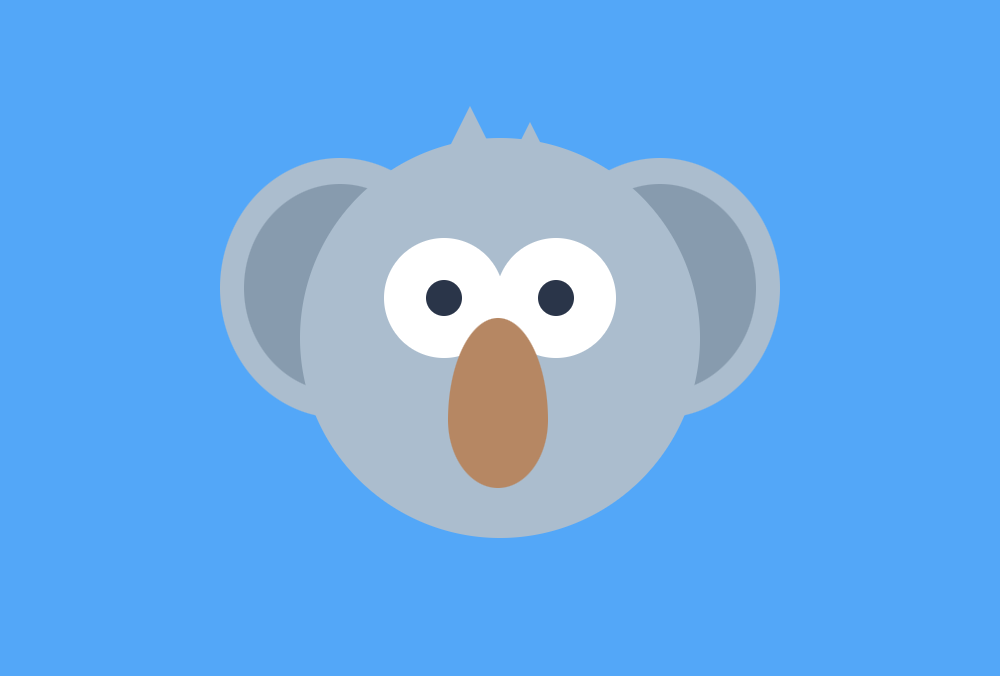

# Recreate the Koala

Remember to commit after each task so that you can see your progress!

## Task 1

Practice your HTML and CSS skills to recreate the picture of a [koala](./koala.png). Use [this page](https://css-tricks.com/the-shapes-of-css/) to make the shapes, but have a think about how you would go about it before you just use the examples in here so that they make sense to you.

Commit your work before you move on to the bonus tasks.

## Bonus 1

Can you refactor your code to make it responsive? Try using relative units like `%` or `vw`, `vh` rather than absolute units like `px`. Make sure you commit before you start to work on the refactor, or you'll lose all your progress if it goes wrong

## Bonus 2

Can you animate the Koala? You'll have to research how to use CSS animations and transitions. :) You can use documentation such as [W3 Schools](https://www.w3schools.com/css/css3_animations.asp) as a starting point, although there are plenty of cool resources online to find.
